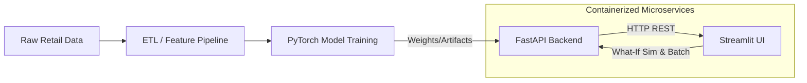

# E-Commerce Deep Learning Insights & Recommendations

A production-ready Deep Learning microservice architecture for real-time customer analytics. This project replaces traditional machine learning models with highly optimized PyTorch Neural Networks exposed via a high-performance FastAPI backend.

## System Architecture



### 1. Neural Collaborative Filtering (NCF)
* **Goal**: Product Recommendations.
* **Architecture**: Learns dense vector embeddings for `CustomerID` and `StockCode` and maps them through an MLP to predict purchase affinity.

### 2. Multi-Task Neural Network (MTL)
* **Goal**: Predict CLV & Churn.
* **Architecture**: A PyTorch network with shared hidden layers parsing scaled RFM features. It splits into a Regression head (90-Day Continuous CLV) and a Classification head (Churn Probability).

## Features
* **Interactive "What-If" Simulator**: Drag sliders for Recency, Frequency, and Spend to dynamically hit the FastAPI endpoint in real-time and watch the PyTorch predictions instantly update.
* **Explainable AI (XAI)**: View heuristic feature attributions explaining *why* a customer is highly likely to churn.
* **Batch Processing**: Upload large `.csv` files for instantaneous batch scoring via the API.
* **Docker Support**: Instantly orchestrate the backend API and frontend Streamlit apps using `docker-compose`.

## Deployment

### Docker (Recommended)
You can launch the entire stack using Docker:
```bash
docker-compose up --build
```
- **Streamlit App**: http://localhost:8501
- **FastAPI Docs**: http://localhost:8000/docs

### Local Environment (uv)
Alternatively, you can run the services locally in separate terminal windows:
```bash
# Setup environment
uv venv --python 3.11 venv
uv pip install -r requirements.txt

# Terminal 1: Launch FastAPI Backend
uvicorn api:app --reload

# Terminal 2: Launch Streamlit Dashboard
streamlit run app.py
```
