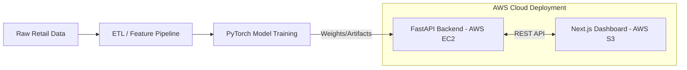

# E-Commerce Deep Learning Insights & Recommendations

A production-ready Deep Learning microservice architecture for real-time customer analytics. This project replaces traditional machine learning models with highly optimized PyTorch Neural Networks exposed via a high-performance FastAPI backend.

## System Architecture



### 1. Neural Collaborative Filtering (NCF)
* **Goal**: Product Recommendations.
* **Architecture**: Learns dense vector embeddings for `CustomerID` and `StockCode` and maps them through an MLP to predict purchase affinity.

### 2. Multi-Task Neural Network (MTL)
* **Goal**: Predict CLV & Churn.
* **Architecture**: A PyTorch network with shared hidden layers parsing scaled RFM features. It splits into a Regression head (90-Day Continuous CLV) and a Classification head (Churn Probability).

## Features
* **Interactive "What-If" Simulator**: Modify sliders for Recency, Frequency, and Spend to dynamically hit the FastAPI endpoint in real-time and watch the PyTorch predictions instantly update on the Next.js dashboard.
* **Explainable AI (XAI)**: View heuristic feature attributions explaining *why* a customer is highly likely to churn.
* **Batch Processing**: Upload large `.csv` files for instantaneous batch scoring via the API.
* **Cloud Infrastructure**: Seamlessly orchestrate the backend API on AWS EC2 and frontend Next.js apps using AWS S3 via Terraform.

## Live Deployment

🚀 **The Next.js Frontend is currently live at:**
[http://ecommerce-frontend-e82c3453.s3-website-us-east-1.amazonaws.com](http://ecommerce-frontend-e82c3453.s3-website-us-east-1.amazonaws.com)

🚀 **The FastAPI Backend is currently running on AWS EC2 at:**
`http://100.30.233.15:8000`

## Deployment Guides

### AWS / Terraform
You can recreate the entire stack using Terraform:
```bash
cd terraform
terraform init
terraform apply -auto-approve
```
Then deploy the Next.js frontend to the created S3 bucket:
```bash
cd frontend
npm run build
aws s3 sync out/ s3://<your-bucket-name>
```

### Local Environment
Alternatively, you can run the services locally in separate terminal windows:
```bash
# Terminal 1: Launch FastAPI Backend
uv venv --python 3.11 venv
uv pip install -r requirements.txt
uvicorn api:app --reload

# Terminal 2: Launch Next.js Dashboard
cd frontend
npm run dev
```
