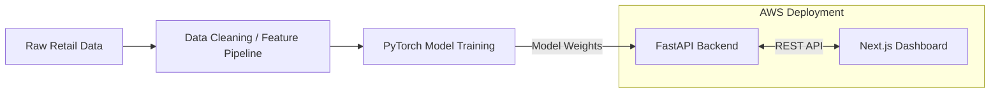

# E-Commerce Deep Learning Microservices

A deep learning system for e-commerce customer analytics: it trains PyTorch models for **product recommendations** and **customer lifetime value (CLV) / churn prediction**, serves them through a **FastAPI** backend, and visualizes results in a **Next.js** dashboard. Infrastructure is defined with **Terraform** for deployment to AWS (EC2 + S3).

## Architecture



**Models**

| Model | Task | Approach |
|---|---|---|
| **NCF Recommender** (`src/dl_recommender.py`) | Product recommendations | Neural Collaborative Filtering — learns embeddings for `CustomerID` and `StockCode`, scores affinity via an MLP over concatenated embeddings |
| **Multi-Task CLV/Churn** (`src/dl_clv_churn.py`) | Customer value & retention | Shared PyTorch trunk over scaled RFM (Recency, Frequency, Monetary) features, branching into a regression head (90-day CLV) and a classification head (churn probability) |

## Project structure

```
.
├── api.py                  # FastAPI app: model loading + prediction endpoints
├── run_pipeline.py         # Runs both training scripts end-to-end
├── download_data.py        # Downloads the raw UCI "Online Retail" dataset
├── src/
│   ├── data_prep.py         # Cleans raw retail data into a parquet file
│   ├── dl_recommender.py    # NCF model: data prep, training, inference precompute
│   └── dl_clv_churn.py      # Multi-task CLV/churn model
├── tests/                  # Pytest unit tests for the data pipeline
├── frontend/                # Next.js dashboard (React 19, Tailwind, shadcn/ui)
├── terraform/               # AWS infra: EC2 (API host) + S3 (frontend hosting)
└── temporary/                # Dockerfile + docker-compose for the API
```

## Prerequisites

- Python 3.11
- Node.js 18+ and npm
- (Optional) Docker, for containerized API deployment
- (Optional) Terraform + an AWS account, for cloud deployment

## Getting started locally

### 1. Get the data

```bash
python download_data.py
```

This downloads the UCI "Online Retail" dataset into `data/Online Retail.xlsx`.

### 2. Set up the Python environment

```bash
python -m venv venv
source venv/bin/activate        # Windows: venv\Scripts\activate
pip install -r requirements.txt
```

### 3. Run the pipeline

```bash
python src/data_prep.py     # Clean the raw data -> data/cleaned_retail.parquet
python run_pipeline.py      # Train both models -> writes artifacts/*.pt
```

### 4. Start the API

```bash
uvicorn api:app --reload
```

The API will be available at `http://localhost:8000`, with interactive docs at `http://localhost:8000/docs`.

### 5. Start the frontend

```bash
cd frontend
npm install
npm run dev
```

The dashboard will be available at `http://localhost:3000`. It talks to the API via `NEXT_PUBLIC_API_URL` (defaults to `http://localhost:8000`).

## API reference

| Method | Endpoint | Description |
|---|---|---|
| `GET` | `/health` | Health check |
| `POST` | `/predict/clv` | Predict CLV + churn probability for one customer given `recency`, `frequency`, `monetary` |
| `GET` | `/recommend/{customer_id}` | Top-5 product recommendations for a known customer |
| `POST` | `/batch_predict` | Upload a CSV (`CustomerID, Recency, Frequency, Monetary`) for batch scoring |

## Running with Docker

```bash
cd temporary
docker-compose up --build
```

This builds the API image (`Dockerfile.api`) and mounts `artifacts/` and `data/` as volumes.

## Deploying to AWS

Infrastructure is defined in `terraform/main.tf`: an EC2 instance for the API and an S3 bucket for static frontend hosting.

```bash
cd terraform
terraform init
terraform apply
```

```bash
cd frontend
npm run build
aws s3 sync out/ s3://<your-bucket-name>
```

> **Note:** the Terraform config writes a generated SSH private key to `terraform/ecommerce-key.pem` for EC2 access. Keep this file out of version control (add `*.pem` to `.gitignore`) and prefer AWS Systems Manager Session Manager over SSH where possible, since the EC2 role already has the required SSM permissions attached.

## Testing

```bash
pytest tests/
```

## Tech stack

- **ML/Backend:** PyTorch, FastAPI, pandas, scikit-learn, boto3
- **Frontend:** Next.js, React, TypeScript, Tailwind CSS, shadcn/ui, Recharts
- **Infrastructure:** Terraform, AWS (EC2, S3), Docker
